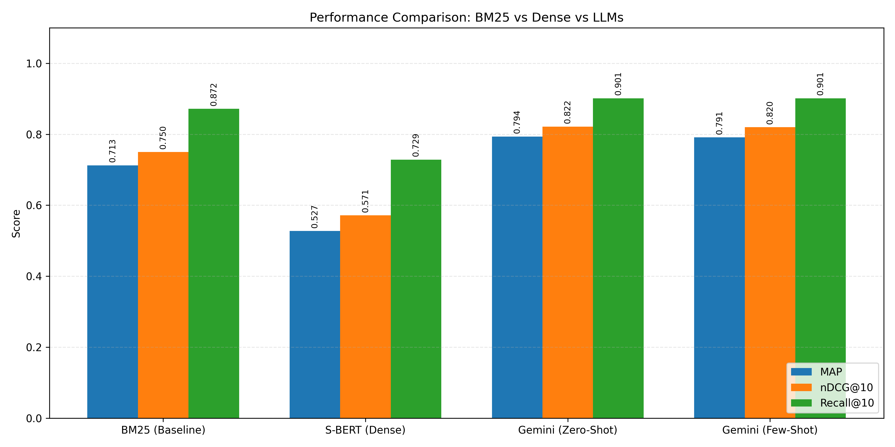

# Few-Shot and Zero-Shot Retrieval using Prompt Engineering

**Student:** Furkan KARA (300201046)  
**Course:** CENG543 - Term Project

## Project Overview
This project investigates the effectiveness of Large Language Models (LLMs) for information 
retrieval in the legal domain. It implements a "Retrieve-then-Rerank" pipeline that compares 
traditional keyword-based methods against modern semantic and LLM-powered reranking strategies 
using the Turkish Law Dataset. Here systems compared are listed:

**BM25 (Sparse Baseline):** Keyword-based retrieval.\
**Sentence-BERT (Dense Baseline):** Semantic similarity retrieval.\
**Gemini Zero-Shot Reranking:** Ranking via LLM without prior examples.\
**Gemini Few-Shot Reranking:** Ranking via LLM using in-context few-shot examples.

## Installation

1. **Clone or download** this repository.
2. **Install dependencies** using the provided requirements file:  
   ` pip install -r requirements.txt `
3. **(Optional) Enable GPU Support:** By default, the command above 
installs the CPU version of PyTorch (on Windows) to keep the file size 
small. If you have an NVIDIA GPU and want faster processing, run this 
command on your terminal after installing requirements: 
   `pip install torch torchvision torchaudio --index-url https://download.pytorch.org/whl/cu121`
4. **Set up API Key:**  
Create a file named `.env` in the root directory.
Add your Google Gemini API key:
GOOGLE_API_KEY=your_api_key_here

## Usage Pipeline
Simply run the `python main.py` file, and it will execute all necessary files in correct order.\
Here is the order to of the files.

**1. Data Preparation**  
Converts raw data into the standard corpus, queries, and qrels (TREC format).  
`python prepare_data.py`  
`python fix_qrels.py`

**2. Run Baselines**  
Generates the initial retrieval runs using BM25 and S-BERT.  
`python baseline_bm25.py`  
`python baseline_sbert.py`

**3. Run LLM Reranking**  
Uses the Gemini API to rerank the top results from BM25. Note: These scripts require a valid API key and 
internet connection.  
`python rerank_gemini.py`          # Zero-Shot  
`python rerank_gemini_fewshot.py`  # Few-Shot

**4. Evaluation**
Calculates the following metrics for all systems to assess performance:
* **Mean Average Precision (MAP):** Measures overall system quality, rewarding systems that place relevant documents higher.
* **Normalized Discounted Cumulative Gain (nDCG@10):** Measures ranking quality, giving more weight to highly relevant documents at the top.
* **Recall at k (R@10):** Measures coverage, or what percentage of the relevant documents were found in the top 10.

Run the evaluation script:
`python evaluate.py`
 
**5. Visualization (Optional)**  
Generates a bar chart comparison of the results.  
`python plot_results.py`

## File Structure
**main.py:** The central orchestrator that runs the entire pipeline in sequence.\

**src/:** Contains the core logic scripts for the retrieval pipeline.\
&nbsp;&nbsp;&nbsp;&nbsp;**prepare_data.py:** Preprocesses raw CSV/Excel data into JSONL format for the corpus and queries.\
&nbsp;&nbsp;&nbsp;&nbsp;**fix_qrels.py:** Formats the ground truth data (Qrels) into the standard TREC format.\
&nbsp;&nbsp;&nbsp;&nbsp;**baseline_bm25.py:** Implements sparse retrieval using the BM25Okapi algorithm.\
&nbsp;&nbsp;&nbsp;&nbsp;**baseline_sbert.py:** Implements dense retrieval using the Sentence-BERT model.\
&nbsp;&nbsp;&nbsp;&nbsp;**rerank_gemini.py:** Implements Zero-shot reranking using the Gemini-2.0-Flash API.\
&nbsp;&nbsp;&nbsp;&nbsp;**rerank_gemini_fewshot.py:** Implements Few-shot reranking with prompt engineering and in-context examples.

**evaluate.py:** Calculates IR metrics (MAP, nDCG@10, and Recall) for all generated runs.\
**plot_results.py:** Generates a bar chart comparison of performance metrics.

**requirements.txt:** List of Python dependencies required to run the project.\
**.env:** (User-created) Stores the necessary API keys for Gemini integration.

**data/:** Organized directory for project datasets.\
&nbsp;&nbsp;&nbsp;&nbsp;**raw/:** Contains the original, unprocessed `raw_data.csv`.\
&nbsp;&nbsp;&nbsp;&nbsp;**processed/:** Cleaned data including corpus.jsonl, queries.jsonl, and TREC-formatted `qrels.tsv`.

**outputs/:** Stores all generated run results and visualizations.\
&nbsp;&nbsp;&nbsp;&nbsp;**run_*.txt:** Retrieval and reranking output files (BM25, S-BERT, Gemini).\
&nbsp;&nbsp;&nbsp;&nbsp;**results_chart.png:** The visual performance comparison chart.

## Results Summary
The evaluation on the Turkish Law Dataset demonstrates that LLM-based reranking significantly enhances retrieval precision compared to traditional methods.\
Gemini Few-Shot achieved the highest overall performance (MAP: 0.7633), indicating that providing in-context examples helps the model better understand the nuances of Turkish legal queries.\
BM25 remains a very robust baseline for Turkish text, outperforming the S-BERT dense model, which likely struggled due to a lack of domain-specific fine-tuning on Turkish legal terminology.\
Gemini Zero-Shot also showed impressive gains over the baselines, proving that prompt engineering is a viable alternative to expensive fine-tuning for domain-specific tasks.

| Model              | MAP        | nDCG@10    | Recall@10   |
|--------------------|------------|------------|-------------|
| BM25 (Baseline)    | 0.7126     | 0.7500     | 0.8718      |
| S-BERT (Dense)     | 0.5275     | 0.5713     | 0.7287      |
| Gemini (Zero-Shot) | **0.7934** | **0.8212** | **0.9013**  |
|  Gemini (Few-Shot) | 0.7639     | 0.7991     | **0.9013**  |
